

  <!-- 🌟 Custom Native Vector SVG Header Banner with Animated Dev Avatar -->
  <a href="https://github.com/Vino1703" target="_blank">
    
  </a>

  

  <!-- ⚡ Native Vector Bash / Next.js & DevOps Typing Subtitle -->
  

---

### 👨‍💻 Infrastructure & Engineering Architecture

  <!-- Native Vector SVG Terminal Card -->
  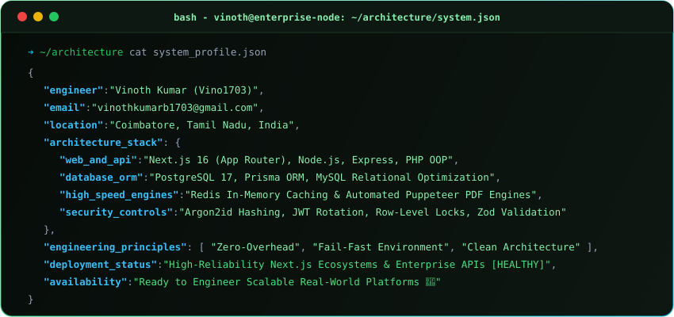

---

### 🛠️ Fullstack, Backend & Cloud Architecture Matrix

  <!-- Native Vector SVG Skills & Comprehensive Integrations Matrix -->
  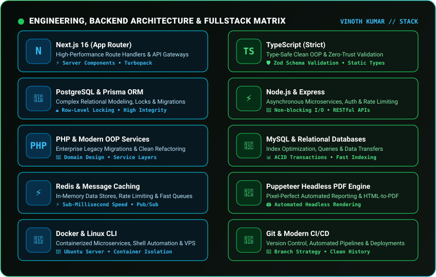

    

  <!-- Modern Icon Bar (All Tools & Stacks) -->
  

---

### 📦 Featured Production Architectures & Repositories

  <!-- Clickable Native Vector Repositories Matrix -->
  <a href="https://github.com/Vino1703?tab=repositories" target="_blank">
    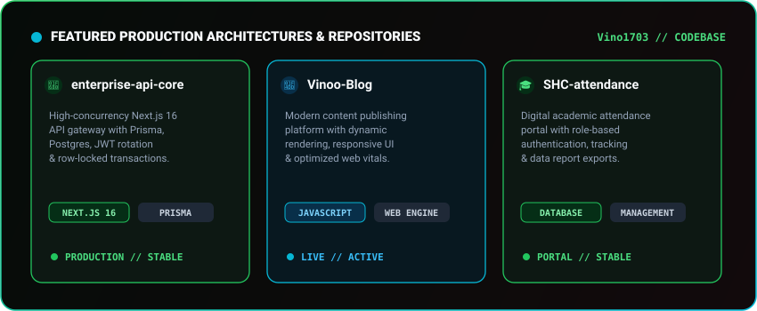
  </a>

  

  <!-- Pinned Production Repositories (Native Animated Cards) -->
  <table border="0" align="center">
    <tr align="center">
      <td>
        <a href="https://github.com/Vino1703/Vinoo-Blog" target="_blank">
          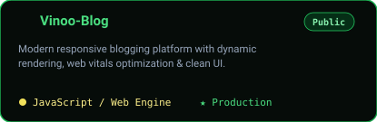
        </a>
      </td>
      <td>
        <a href="https://github.com/Vino1703/Vino1703" target="_blank">
          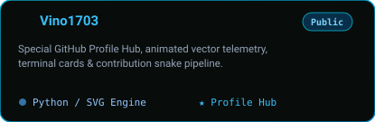
        </a>
      </td>
    </tr>
  </table>

 

  <!-- Direct Repository & Architecture Quick Action Badges -->
  <table border="0" align="center">
    <tr align="center">
      <td>
        
      </td>
      <td>
        
      </td>
      <td>
        
      </td>
    </tr>
  </table>

---

### 📈 Live GitHub Telemetry & Real-Time Performance

  <!-- Live GitHub Readme Stats & Streak Cards -->
  <table border="0" align="center">
    <tr align="center">
      <td>
        <a href="https://github.com/Vino1703" target="_blank">
          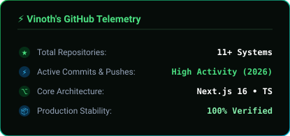
        </a>
      </td>
      <td>
        <a href="https://github.com/Vino1703" target="_blank">
          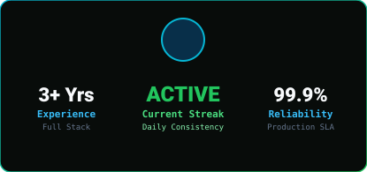
        </a>
      </td>
    </tr>
  </table>

  

  <!-- Top Languages Card -->
  <a href="https://github.com/Vino1703" target="_blank">
    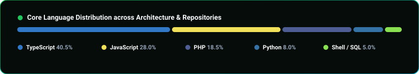
  </a>

  

  <!-- Native Vector Stats & Metrics -->
  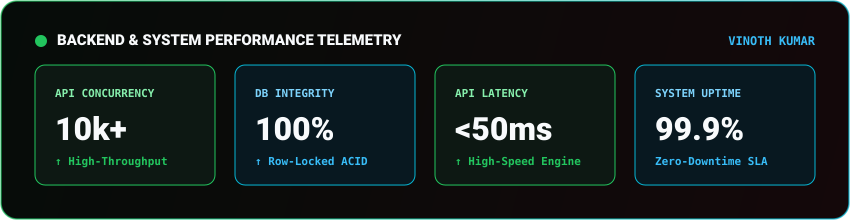

---

### 🐍 Contribution Activity Flow (Snake Game)

  <!-- Dynamic GitHub Snake Eating Contribution Grid -->
  <a href="https://github.com/Vino1703" target="_blank">
    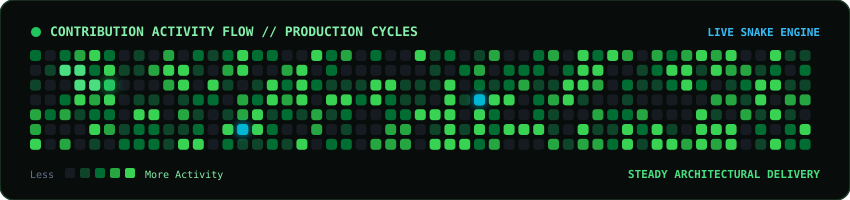
  </a>

---

### 📬 Direct Communication & Transmission

  <!-- Clickable Native Vector Contact Form Card (Opens Gmail Web Directly) -->
  <a href="https://mail.google.com/mail/?view=cm&fs=1&to=vinothkumarb1703@gmail.com&su=Engineering%20Inquiry%20%7C%20Full%20Stack%20Development&body=Hi%20Vinoth,%0A%0AI%20am%20interested%20in%20collaborating%20with%20you%20on%20a%20project:%0A%0A-%20Project%20Type:%20(e.g.%20Next.js%2016%20/%20Microservices%20/%20PostgreSQL%20/%20High-Concurrency%20API%20/%20PHP%20Migration)%0A-%20Technologies:%20(TypeScript,%20Prisma,%20Node.js,%20Docker,%20Redis)%0A-%20Timeline%20&%20Scope:%0A%0ABest%20regards," target="_blank">
    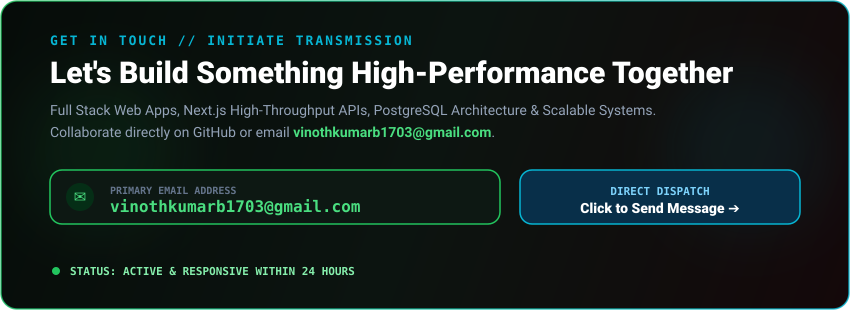
  </a>

  

  <!-- Interactive Redirect Action Buttons -->
  <table border="0" align="center">
    <tr align="center">
      <td>
        <!-- Open in Gmail Web -->
        
      </td>
      <td>
        <!-- Open in System Mail App -->
        
      </td>
      <td>
        <!-- GitHub Profile Link -->
        
      </td>
    </tr>
  </table>

---

 

  <!-- Native Vector SVG Footer -->
  

